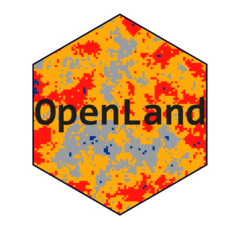
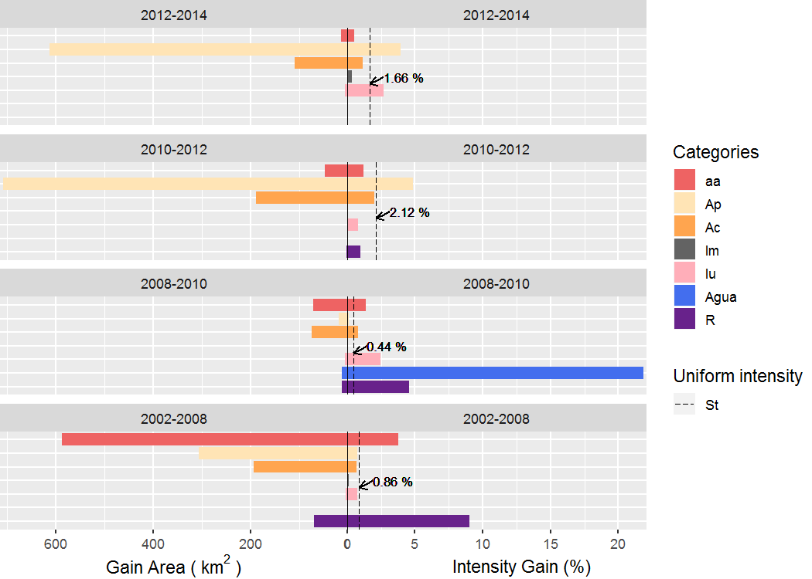
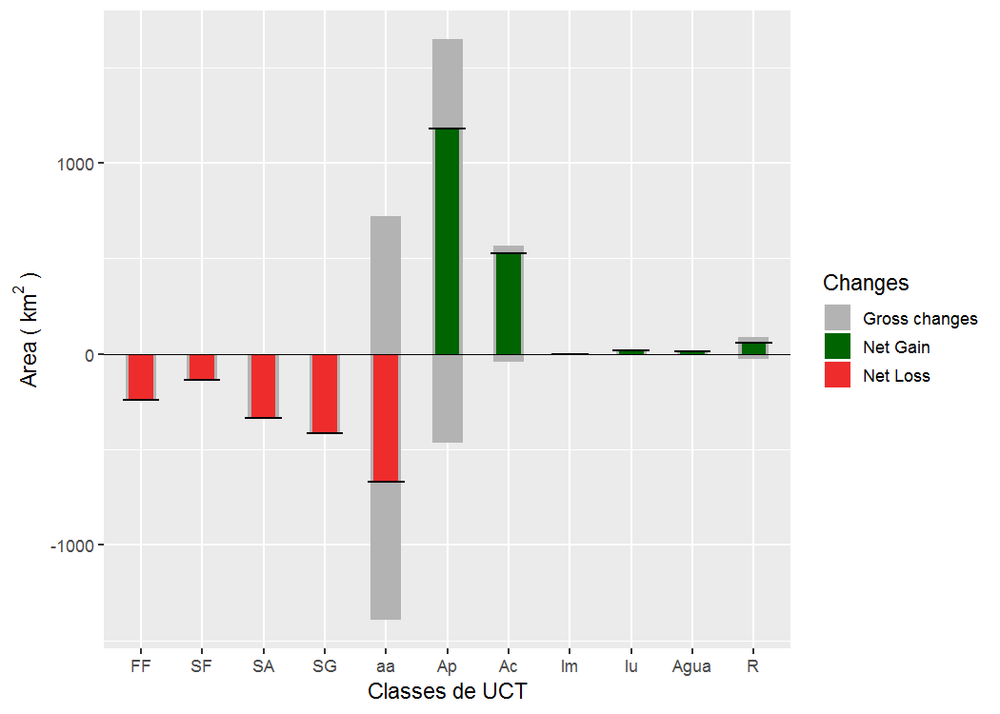
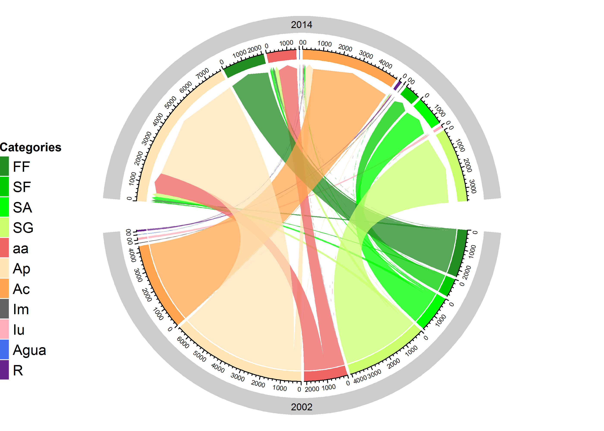

<!-- README.md is generated from README.Rmd. Please edit that file -->

# OpenLand 

<!-- badges: start -->

[](https://github.com/reginalexavier/OpenLand/actions)
[](https://app.codecov.io/gh/reginalexavier/OpenLand)
[](https://www.gnu.org/licenses/gpl-3.0)
[](https://CRAN.R-project.org/package=OpenLand)
<!-- badges: end -->

OpenLand is an open-source R package for the analysis of land use and
cover (LUC) time series. It includes support for consistency check and
loading spatiotemporal raster data and synthesized spatial plotting.
Several LUC change (LUCC) metrics in regular or irregular time intervals
can be extracted and visualized through one- and multistep sankey and
chord diagrams. A complete intensity analysis according to (Aldwaik and
Pontius 2012) is implemented, including tools for the generation of
standardized multilevel output graphics.

## Installation

Install the released version of OpenLand from CRAN:

``` r
install.packages("OpenLand")
```

Or install the development version from GitHub with:

``` r
# install.packages("devtools")
devtools::install_github("reginalexavier/OpenLand")
```

## Illustrative Example

This is a basic example which shows how OpenLand works, for a more
detailed illustration, please see our
[vignettes](https://reginalexavier.github.io/OpenLand/articles/openland_vignette.html).

The OpenLand functionality is illustrated for a LUC dataset of São
Lourenço river basin, a major Pantanal wetland contribution area as
provided by the 4<sup>th</sup> edition of the [Monitoring of Changes in
Land cover and Land Use in the Upper Paraguay River Basin - Brazilian
portion - Review Period: 2012 to
2014](https://www.embrapa.br/pantanal/bacia-do-alto-paraguai) (Embrapa
Pantanal, Instituto SOS Pantanal, and WWF-Brasil 2015). The time series
is composed by five LUC maps (2002, 2008, 2010, 2012 and 2014). The
study area of approximately 22,400 km<sup>2</sup> is located in the
Cerrado Savannah biom in the southeast of the Brazilian state of Mato
Grosso. For processing in the OpenLand package, the original multi-year
shape file was transformed into rasters and then saved as a 5-layer
`RasterStack` (`SaoLourencoBasin`), available from a public repository
[(10.5281/zenodo.3685229)](https://doi.org/10.5281/zenodo.3685230) as an
`.RDA` file which can be loaded into `R`.

``` r
# Loading the package
library(OpenLand)
```

##### **What is Intensity Analysis?**

Intensity Analysis (IA) is a quantitative method to analyze LUC maps at
several time steps, using cross-tabulation matrices, where each matrix
summarizes the LUC change at each time interval. IA evaluates in three
levels the deviation between observed change intensity and hypothesized
uniform change intensity. Hereby, each level details information given
by the previous analysis level. First, the **interval level** indicates
how size and rate of change varies across time intervals. Second, the
**category level** examines for each time interval how the size and
intensity of gross losses and gross gains in each category vary across
categories for each time interval. Third, the **transition level**
determines for each category how the size and intensity of a category’s
transitions vary across the other categories that are available for that
transition. At each level, the method tests for stationarity of patterns
across time intervals (Aldwaik and Pontius 2012).

### Outcomes of intensity analysis

The data is extracted from the rasters with the
[`contingencyTable()`](https://reginalexavier.github.io/OpenLand/reference/contingencyTable.html)
function which returns a multiple grid information in tables for the
next processing steps. Within the OpenLand package, the
[`intensityAnalysis()`](https://reginalexavier.github.io/OpenLand/reference/intensityAnalysis.html)
function computes the three levels of analysis. It requires the object
returned by the `contingenceTable()` function and that the user
predefines two LUC categories `n` and `m`. Generally, `n` is a target
category which experienced relevant gains and `m` a category with
important losses.

``` r
my_test <- intensityAnalysis(dataset = SL_2002_2014, # here the outcome from the `contingenceTable()` function
                            category_n = "Ap", category_m = "SG")

# it returns a list with 6 objects
names(my_test)
#> [1] "lulc_table"           "interval_lvl"         "category_lvlGain"    
#> [4] "category_lvlLoss"     "transition_lvlGain_n" "transition_lvlLoss_m"
```

The `intensityAnalysis()` function returns 6 objects: lulc_table,
interval_lvl, category_lvlGain, category_lvlLoss, transition_lvlGain_n,
transition_lvlLoss_m. Here, we adopted an object-oriented approach that
allows to set specific methods for plotting the intensity objects.
Specifically, we used the S4 class, which requires the formal definition
of classes and methods (Chambers 2008).

#### Presentation of an intensity object

In this example we will show an object from `Category` class. A
`Category` object contains three slots: the first contains the colors
associated with the legend items as name attributes, the second slot
contains a table of the **category level** result *(gain
(G<sub>tj</sub>) or loss (L<sub>ti</sub>) values)* and the third slot
contains a table storing the results of a stationarity test.

``` r

my_test$category_lvlGain
#> An object of class "Category"
#> Slot "lookupcolor":
#>        Ap        FF        SA        SG        aa        SF      Agua        Iu 
#> "#FFE4B5" "#228B22" "#00FF00" "#CAFF70" "#EE6363" "#00CD00" "#436EEE" "#FFAEB9" 
#>        Ac         R        Im 
#> "#FFA54F" "#68228B" "#636363" 
#> 
#> Slot "categoryData":
#> # A tibble: 23 × 6
#> # Groups:   Period, To [23]
#>    Period    To    Interval  GG_km2   Gtj    St
#>    <fct>     <fct>    <int>   <dbl> <dbl> <dbl>
#>  1 2012-2014 aa           2  14.9   0.510  1.66
#>  2 2012-2014 Ap           2 612.    3.92   1.66
#>  3 2012-2014 Ac           2 110.    1.14   1.66
#>  4 2012-2014 Im           2   0.195 0.337  1.66
#>  5 2012-2014 Iu           2   6.79  2.67   1.66
#>  6 2010-2012 aa           2  47.0   1.18   2.12
#>  7 2010-2012 Ap           2 707.    4.84   2.12
#>  8 2010-2012 Ac           2 189.    2.00   2.12
#>  9 2010-2012 Iu           2   1.90  0.792  2.12
#> 10 2010-2012 R            2   2.76  0.951  2.12
#> # ℹ 13 more rows
#> 
#> Slot "categoryStationarity":
#> # A tibble: 12 × 5
#>    To     Gain     N Stationarity Test 
#>    <fct> <int> <int> <chr>        <chr>
#>  1 aa        2     4 Active Gain  N    
#>  2 Ap        2     4 Active Gain  N    
#>  3 Ac        1     4 Active Gain  N    
#>  4 Iu        2     4 Active Gain  N    
#>  5 Agua      1     4 Active Gain  N    
#>  6 R         2     4 Active Gain  N    
#>  7 aa        2     4 Dormant Gain N    
#>  8 Ap        2     4 Dormant Gain N    
#>  9 Ac        3     4 Dormant Gain N    
#> 10 Im        3     4 Dormant Gain N    
#> 11 Iu        2     4 Dormant Gain N    
#> 12 R         1     4 Dormant Gain N
```

#### Plotting an intensity object

Visualizations of the IA results are obtained from the
`plot(intensity-object)` function. For more details on the function
arguments, please see the documentation of the
[`plot()`](https://reginalexavier.github.io/OpenLand/reference/plot.html)
method.

``` r

plot(my_test$category_lvlGain,
     labels = c(leftlabel = bquote("Gain Area (" ~km^2~ ")"),
                rightlabel = "Intensity Gain (%)"),
     marginplot = c(.3, .3), labs = c("Categories", "Uniform intensity"), 
     leg_curv = c(x = 1, y = .5),
     fontsize_ui = 8)
```

<div class="figure" style="text-align: center">


<p class="caption">
Gain area outcome - Category level
</p>

</div>

### Miscellaneous visualization tools

OpenLand provides a bench of visualization tools of LUCC metrics.
One-step transitions can be balanced by net and gross changes of all
categories through a combined bar chart. Transitions between LUC
categories can be detailed by a circular chord chart, based on the
Circlize package (Gu et al. 2014). An implementation of Sankey diagram
based on the networkD3 package (Allaire et al. 2017) allow the
representation of one- and multistep LUCC between categories. Areal
development of all LUC categories throughout the observation period can
be visualized by a grouped bar chart.

##### Net and Gross gain and loss

``` r

netgrossplot(dataset = SL_2002_2014$lulc_Multistep,
             legendtable = SL_2002_2014$tb_legend,
             xlab = "LUC Category",
             ylab = bquote("Area (" ~ km^2 ~ ")"),
             changesLabel = c(GC = "Gross changes", NG = "Net Gain", NL = "Net Loss"),
             color = c(GC = "gray70", NG = "#006400", NL = "#EE2C2C")
             )
```

<div class="figure" style="text-align: center">


<p class="caption">
Net Gross Changes 2002 - 2014
</p>

</div>

##### Chord Diagram (2002 - 2014)

``` r

chordDiagramLand(dataset = SL_2002_2014$lulc_Onestep,
                 legendtable = SL_2002_2014$tb_legend)
```

<div class="figure" style="text-align: center">


<p class="caption">
Chord Diagram 2002 - 2014 (area in km<sup>2</sup>)
</p>

</div>

##### Sankey Multi Step (2002, 2008, 2010, 2012, 2014)

``` r

# sankeyLand(dataset = SL_2002_2014$lulc_Multistep,
#            legendtable = SL_2002_2014$tb_legend)
```


#### Other functions

OpenLand enables furthermore the spatial screening of LUCC frequencies
for one or a series of raster layers with
[`summary_map()`](https://reginalexavier.github.io/OpenLand/reference/summary_map.html)
and
[`summary_dir()`](https://reginalexavier.github.io/OpenLand/reference/summary_dir.html).
The
[`acc_changes()`](https://reginalexavier.github.io/OpenLand/reference/acc_changes.html)
function returns for a LUC time series the number of times a pixel has
changed during the analysed period, returning a grid layer and a table
with the percentages of transition numbers in the study area. Here we
use the [tmap](https://github.com/r-tmap/tmap) package for plotting the
outcomes of the `acc_changes()` function.

<div class="figure" style="text-align: center">


<p class="caption">
Accumulated changes in pixels in the interval 2002 - 2014 at four time
points (2002, 2008, 2010, 2012, 2014)
</p>

</div>

## References

Aldwaik, Safaa Zakaria, and Robert Gilmore Pontius. 2012. “Intensity
analysis to unify measurements of size and stationarity of land changes
by interval, category, and transition.” Landsc. Urban Plan. 106 (1):
103–14. <https://doi.org/10.1016/j.landurbplan.2012.02.010>.

Allaire, J J, Christopher Gandrud, Kenton Russell, and C J Yetman. 2017.
“networkD3: D3 JavaScript Network Graphs from R.”
<https://cran.r-project.org/package=networkD3>.

Chambers, John. 2008. Software for Data Analysis. Statistics and
Computing. New York, NY: Springer New York.
<https://doi.org/10.1007/978-0-387-75936-4>.

Embrapa Pantanal, Instituto SOS Pantanal, and WWF-Brasil. 2015.
“Mapeamento da Bacia do Alto Paraguai.”
<https://www.embrapa.br/pantanal/bacia-do-alto-paraguai>.

Gu, Zuguang, Lei Gu, Roland Eils, Matthias Schlesner, and Benedikt
Brors. 2014. “circlize implements and enhances circular visualization in
R.” Bioinformatics 30 (19): 2811–2.

------------------------------------------------------------------------

### CITATION:

Reginal Exavier and Peter Zeilhofer. OpenLand: Software for Quantitative
Analysis and Visualization of Land Use and Cover Change. The R Journal,
v. 12, n. 2, p. 359–371, 2021.
[https://doi.org/10.32614/RJ-2021-021](https://journal.r-project.org/archive/2020/RJ-2021-021/index.html).
