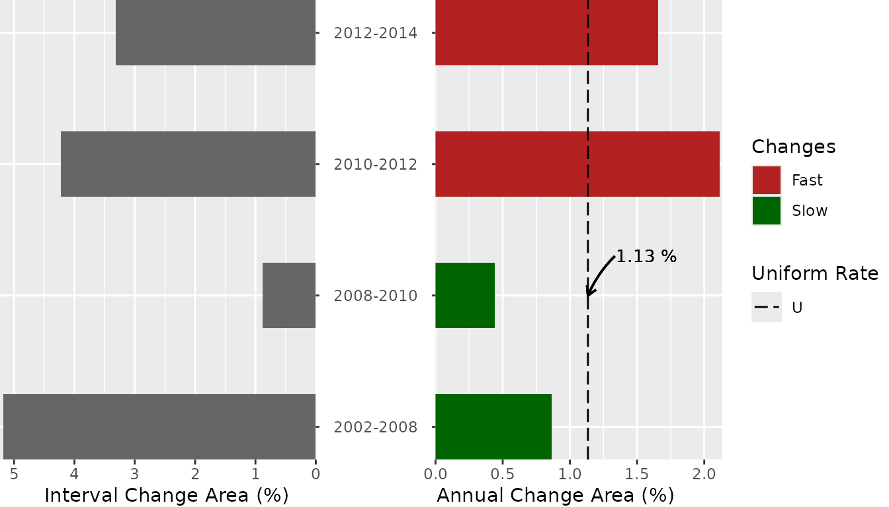
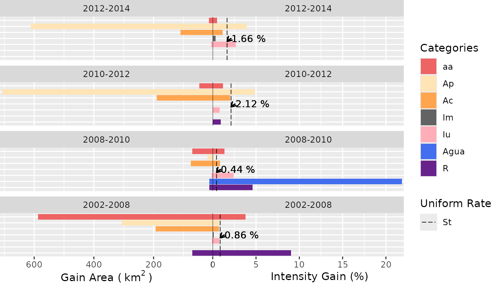
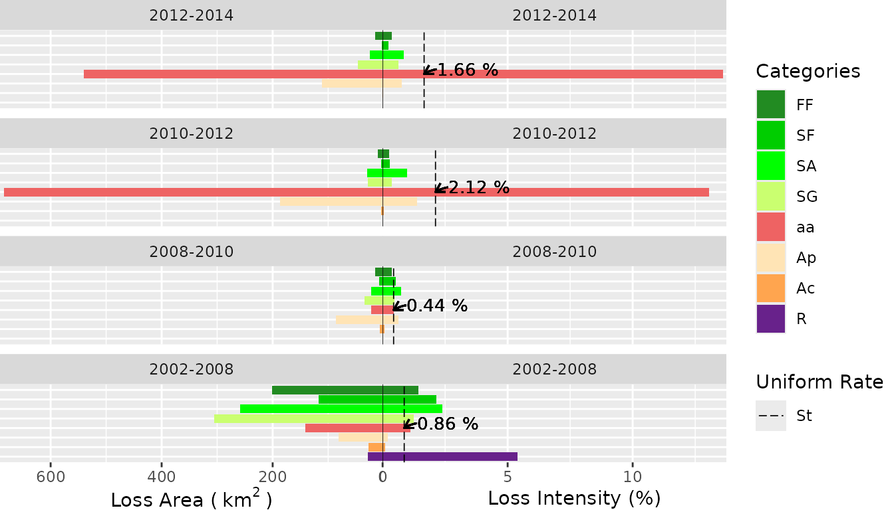
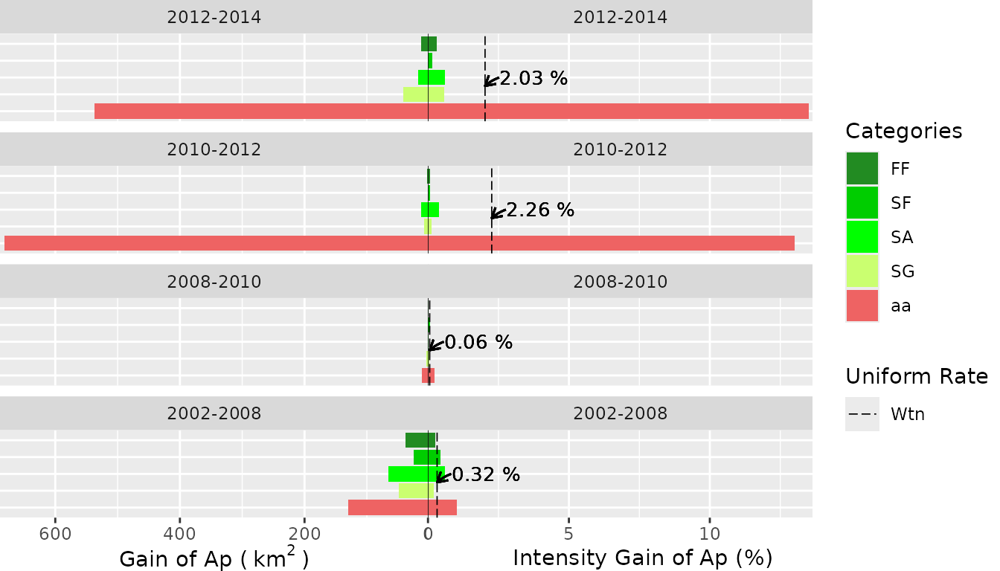
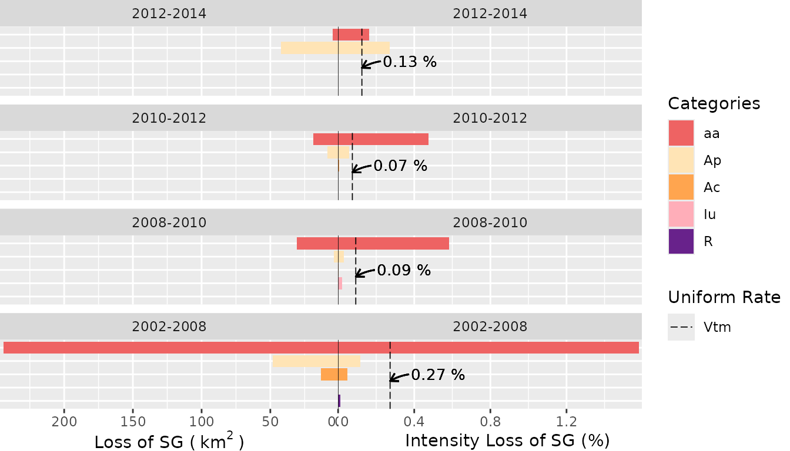
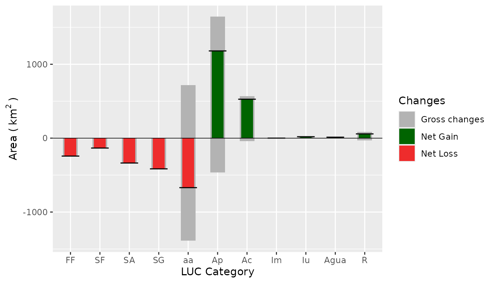
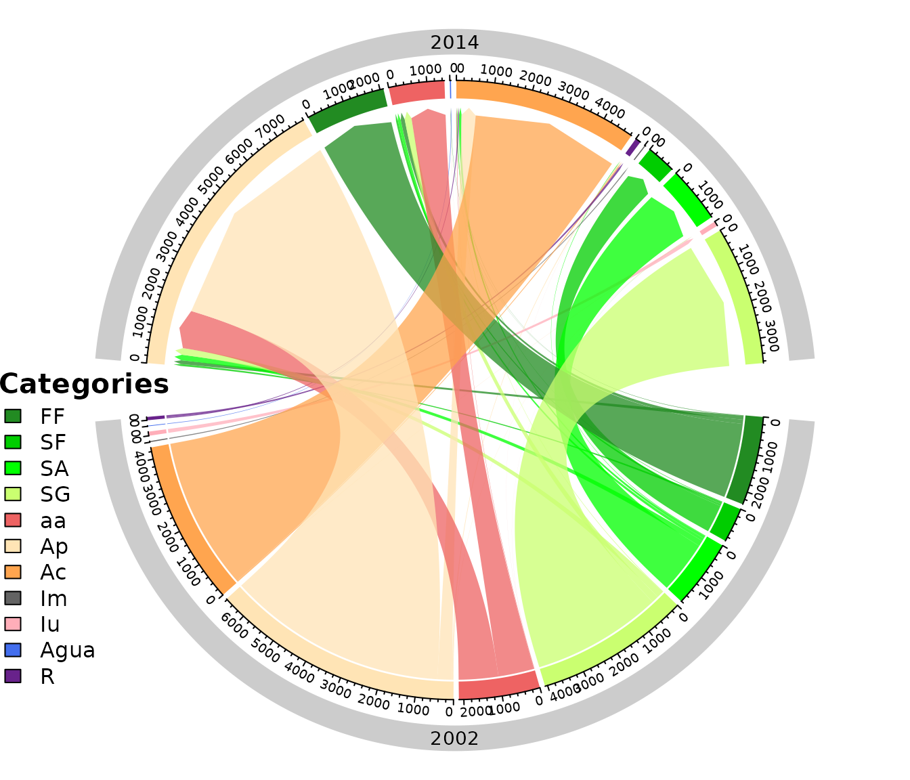
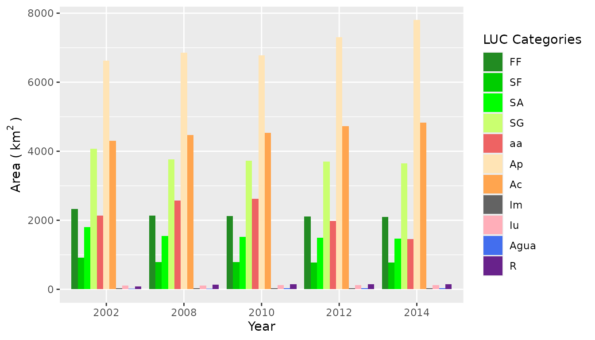

# Quick introduction to the OpenLand package

------------------------------------------------------------------------

**This is a Vignette on how to use the OpenLand package for exploratory
analysis of Land Use and Cover (LUC) time series.**

### Description of the tool

OpenLand is an open-source R package for the analysis of land use and
cover (LUC) time series. It includes support for consistency check and
loading spatiotemporal raster data and synthesized spatial plotting.
Several LUC change (LUCC) metrics in regular or irregular time intervals
can be extracted and visualized through one- and multistep sankey and
chord diagrams. A complete intensity analysis according to (Aldwaik and
Pontius 2012) is implemented, including tools for the generation of
standardized multilevel output graphics.

### São Lourenço river Basin example dataset

The OpenLand functionality is illustrated for a LUC dataset of São
Lourenço river basin, a major Pantanal wetland contribution area as
provided by the 4^(th) edition of the [Monitoring of Changes in Land
cover and Land Use in the Upper Paraguay River Basin - Brazilian
portion - Review Period: 2012 to
2014](https://www.embrapa.br/pantanal/bacia-do-alto-paraguai) (Embrapa
Pantanal, Instituto SOS Pantanal, and WWF-Brasil 2015). The time series
is composed by five LUC maps (2002, 2008, 2010, 2012 and 2014). The
study area of approximately 22,400 km² is located in the Cerrado
Savannah biom in the southeast of the Brazilian state of Mato Grosso,
which has experienced a LUCC of about 12% of its extension during the
12-years period, including deforestation and intensification of existing
agricultural uses. For processing in the OpenLand package, the original
multi-year shape file was transformed into rasters and then saved as a
5-layer `RasterStack` (`SaoLourencoBasin`), available from a public
repository
[(10.5281/zenodo.3685229)](https://doi.org/10.5281/zenodo.3685230) as an
`.RDA` file which can be loaded into `R`.

#### Input data constraints

The function
[`contingencyTable()`](https://reginalexavier.github.io/OpenLand/reference/contingencyTable.md)
for data extraction demands as input a list of raster layers
(`RasterBrick`, `RasterStack` or a path to a folder containing the
rasters). The name of the rasters must be in the format (“some_text” `+`
“underscore” `+` “the_year”) like “landscape_2020”. In our example we
included the `SaoLourencoBasin` RasterStack:

``` r
# first we load the OpenLand package
library(OpenLand)

# The SaoLourencoBasin dataset
SaoLourencoBasin
#> class      : RasterStack 
#> dimensions : 6372, 6546, 41711112, 5  (nrow, ncol, ncell, nlayers)
#> resolution : 30, 30  (x, y)
#> extent     : 654007.5, 850387.5, 8099064, 8290224  (xmin, xmax, ymin, ymax)
#> crs        : +proj=utm +zone=21 +south +ellps=GRS80 +units=m +no_defs 
#> names      : landscape_2002, landscape_2008, landscape_2010, landscape_2012, landscape_2014 
#> min values :              2,              2,              2,              2,              2 
#> max values :             13,             13,             13,             13,             13
```

#### Extracting the data from raster time series

After data extraction
[`contingencyTable()`](https://reginalexavier.github.io/OpenLand/reference/contingencyTable.md)
saves multiple grid information in tables for the next processing steps.
The function returns 5 objects: lulc_Multistep, lulc_Onestep, tb_legend,
totalArea, totalInterval.

The first two objects are contingency tables. The first one
(**lulc_Multistep**) takes into account grid cells of the entire time
series, whereas the second (**lulc_Onestep**) calculates LUC transitions
only between the first and last year of the series. The third object
(**tb_legend**) is a table containing the category name associated with
a pixel value and a respective color used for plotting. Category values
and colors are created randomly by
[`contingencyTable()`](https://reginalexavier.github.io/OpenLand/reference/contingencyTable.md).
Their values must be edited to produce meaningful plot legends and color
schemes. The fourth object (**totalArea**) is a table containing the
extension of the study area in km² and in pixel units. The fifth table
(**totalInterval**) stores the range between the first (Y_(t=1)) and the
last year(Y_(T)) of the series.

Fields, format, description and labeling of a **lulc_Multistep** table
created by the `contingencyTable` are given in the following:

|                   \[Y_(*t*), Y_(*t+1*)\]                   |               Category_(*i*)                |              Category_(*j*)               |                              C_(*tij*)(km²)                               |                              C_(*tij*)(pixel)                               |                      Y_(*t+1*) - Y_(*t*)                      |           Y_(*t*)            |         Y_(*t+1*)          |
|:----------------------------------------------------------:|:-------------------------------------------:|:-----------------------------------------:|:-------------------------------------------------------------------------:|:---------------------------------------------------------------------------:|:-------------------------------------------------------------:|:----------------------------:|:--------------------------:|
|                           `chr`                            |                    `int`                    |                   `int`                   |                                   `dbl`                                   |                                    `int`                                    |                             `int`                             |            `int`             |           `int`            |
| Period of analysis from time point *t* to time point *t+1* | A category at interval’s initial time point | A category at interval’s final time point | Number of elements in km² that transits from category *i* to category *j* | Number of elements in pixel that transits from category *i* to category *j* | Interval in years between time point *t* and time point *t+1* | Initial Year of the interval | Final Year of the interval |
|                         **Period**                         |                  **From**                   |                  **To**                   |                                  **km2**                                  |                                 **QtPixel**                                 |                         **Interval**                          |         **yearFrom**         |         **yearTo**         |

In the **lulc_Onestep** table, the Y_(*t+1*) terms are replaced by
Y_(*T*), where T is the number of time steps, i.e., Y_(*T*) is the last
year of the series.

For our study area,
`contingencyTable(input_raster = SaoLourencoBasin, pixelresolution = 30)`
returns the following outputs:

`{r SL_2002_2014 <- contingencyTable(input_raster = SaoLourencoBasin, pixelresolution = 30)`

``` r
SL_2002_2014$lulc_Multistep[1:10, ]
#> # A tibble: 10 × 8
#>    Period     From    To      km2 QtPixel Interval yearFrom yearTo
#>    <chr>     <int> <int>    <dbl>   <int>    <int>    <int>  <int>
#>  1 2002-2008     2     2 6543.    7269961        6     2002   2008
#>  2 2002-2008     2    10    1.56     1736        6     2002   2008
#>  3 2002-2008     2    11   55.2     61320        6     2002   2008
#>  4 2002-2008     2    12   23.9     26609        6     2002   2008
#>  5 2002-2008     3     2   37.5     41649        6     2002   2008
#>  6 2002-2008     3     3 2133.    2370190        6     2002   2008
#>  7 2002-2008     3     7  155.     172718        6     2002   2008
#>  8 2002-2008     3    11    7.48     8307        6     2002   2008
#>  9 2002-2008     3    12    0.356     395        6     2002   2008
#> 10 2002-2008     3    13    0.081      90        6     2002   2008

SL_2002_2014$lulc_Onestep[1:10, ]
#> # A tibble: 10 × 8
#>    Period     From    To     km2 QtPixel Interval yearFrom yearTo
#>    <chr>     <int> <int>   <dbl>   <int>    <int>    <int>  <int>
#>  1 2002-2014     2     2 6169.   6854816       12     2002   2014
#>  2 2002-2014     2     9    2.39    2651       12     2002   2014
#>  3 2002-2014     2    10   10.4    11513       12     2002   2014
#>  4 2002-2014     2    11  412.    457631       12     2002   2014
#>  5 2002-2014     2    12   29.7    33015       12     2002   2014
#>  6 2002-2014     3     2  110.    121762       12     2002   2014
#>  7 2002-2014     3     3 2091.   2323665       12     2002   2014
#>  8 2002-2014     3     7  116.    129304       12     2002   2014
#>  9 2002-2014     3     9    7.00    7774       12     2002   2014
#> 10 2002-2014     3    11    9.32   10359       12     2002   2014

SL_2002_2014$tb_legend
#> # A tibble: 11 × 3
#>    categoryValue categoryName color  
#>            <int> <fct>        <chr>  
#>  1             2 DUL          #ABBBE8
#>  2             3 XSE          #A13F3F
#>  3             4 LKC          #EAACAC
#>  4             5 MTO          #002F70
#>  5             7 VRE          #8EA4DE
#>  6             8 FNR          #F3C5C5
#>  7             9 ZCN          #5F1415
#>  8            10 EIF          #DCE2F6
#>  9            11 FHX          #F9DCDC
#> 10            12 SZE          #EFF1F8
#> 11            13 HGF          #F9EFEF

SL_2002_2014$totalArea
#> # A tibble: 1 × 2
#>   area_km2  QtPixel
#>      <dbl>    <int>
#> 1   22418. 24908860

SL_2002_2014$totalInterval
#> [1] 12
```

#### Editing the values in the `categoryName` and `color` columns

As mentioned before, the **tb_legend** object must be edited with the
real category name and colors associated with the category values. In
our case, the category names and colors follow the conventions given by
Instituto SOS Pantanal and WWF-Brasil (2015) [(access document here,
page
17)](https://www.embrapa.br/documents/1354999/1529097/BAP+-+Mapeamento+da+Bacia+do+Alto+Paraguai+-+estudo+completo/e66e3afb-2334-4511-96a0-af5642a56283).
The Portuguese legend acronyms were maintained as defined in the
original dataset.

| Pixel Value | Legend | Class     | Use           | Category               | color    |
|:------------|:------:|:----------|:--------------|:-----------------------|:---------|
| 2           |   Ap   | Anthropic | Anthropic Use | Pasture                | \#FFE4B5 |
| 3           |   FF   | Natural   | NA            | Forest                 | \#228B22 |
| 4           |   SA   | Natural   | NA            | Park Savannah          | \#00FF00 |
| 5           |   SG   | Natural   | NA            | Gramineous Savannah    | \#CAFF70 |
| 7           |   aa   | Anthropic | NA            | Anthropized Vegetation | \#EE6363 |
| 8           |   SF   | Natural   | NA            | Wooded Savannah        | \#00CD00 |
| 9           |  Agua  | Natural   | NA            | Water body             | \#436EEE |
| 10          |   Iu   | Anthropic | Anthropic Use | Urban                  | \#FFAEB9 |
| 11          |   Ac   | Anthropic | Anthropic Use | Crop farming           | \#FFA54F |
| 12          |   R    | Anthropic | Anthropic Use | Reforestation          | \#68228B |
| 13          |   Im   | Anthropic | Anthropic Use | Mining                 | \#636363 |

``` r
## editing the category name
SL_2002_2014$tb_legend$categoryName <- factor(
  c(
    "Ap", "FF", "SA", "SG", "aa", "SF",
    "Agua", "Iu", "Ac", "R", "Im"
  ),
  levels = c(
    "FF", "SF", "SA", "SG", "aa", "Ap",
    "Ac", "Im", "Iu", "Agua", "R"
  )
)

## add the color by the same order of the legend,
## it can be the color name (eg. "black") or the HEX value (eg. #000000)
SL_2002_2014$tb_legend$color <- c(
  "#FFE4B5", "#228B22", "#00FF00", "#CAFF70",
  "#EE6363", "#00CD00", "#436EEE", "#FFAEB9",
  "#FFA54F", "#68228B", "#636363"
)

## now we have
SL_2002_2014$tb_legend
#> # A tibble: 11 × 3
#>    categoryValue categoryName color  
#>            <int> <fct>        <chr>  
#>  1             2 Ap           #FFE4B5
#>  2             3 FF           #228B22
#>  3             4 SA           #00FF00
#>  4             5 SG           #CAFF70
#>  5             7 aa           #EE6363
#>  6             8 SF           #00CD00
#>  7             9 Agua         #436EEE
#>  8            10 Iu           #FFAEB9
#>  9            11 Ac           #FFA54F
#> 10            12 R            #68228B
#> 11            13 Im           #636363
```

At this point, one can choose to run the Intensity Analysis or create a
series of non-spatial representations of LUCC, such like sankey diagrams
with the
[`sankeyLand()`](https://reginalexavier.github.io/OpenLand/reference/sankeyLand.md)
function, chord diagrams using the
[`chordDiagramLand()`](https://reginalexavier.github.io/OpenLand/reference/chordDiagramLand.md)
function or bar plots showing LUC evolution trough the years using the
[`barplotLand()`](https://reginalexavier.github.io/OpenLand/reference/barplotLand.md)
function, since they do not depend on the output of Intensity Analysis.

### Intensity Analysis

Intensity Analysis (IA) is a quantitative method to analyze LUC maps at
several time steps, using cross-tabulation matrices, where each matrix
summarizes the LUC change at each time interval. IA evaluates in three
levels the deviation between observed change intensity and hypothesized
uniform change intensity. Hereby, each level details information given
by the previous analysis level. First, the **interval level** indicates
how size and rate of change varies across time intervals. Second, the
**category level** examines for each time interval how the size and
intensity of gross losses and gross gains in each category vary across
categories for each time interval. Third, the **transition level**
determines for each category how the size and intensity of a category’s
transitions vary across the other categories that are available for that
transition. At each level, the method tests for stationarity of patterns
across time intervals (Aldwaik and Pontius 2012).

Within the OpenLand package, the
[`intensityAnalysis()`](https://reginalexavier.github.io/OpenLand/reference/intensityAnalysis.md)
function computes the three levels of analysis. It requires the object
returned by the
[`contingencyTable()`](https://reginalexavier.github.io/OpenLand/reference/contingencyTable.md)
function and that the user predefines two LUC categories `n` and `m`.
Generally, `n` is a target category which experienced relevant gains and
`m` a category with important losses.

``` r
testSL <- intensityAnalysis(
  dataset = SL_2002_2014,
  category_n = "Ap", category_m = "SG"
)

# it returns a list with 6 objects
names(testSL)
#> [1] "lulc_table"           "interval_lvl"         "category_lvlGain"    
#> [4] "category_lvlLoss"     "transition_lvlGain_n" "transition_lvlLoss_m"
```

The
[`intensityAnalysis()`](https://reginalexavier.github.io/OpenLand/reference/intensityAnalysis.md)
function returns 6 objects: lulc_table, interval_lvl, category_lvlGain,
category_lvlLoss, transition_lvlGain_n, transition_lvlLoss_m. Here, we
adopted an object-oriented approach that allows to set specific methods
for plotting the intensity objects. Specifically, we used the S4 class,
which requires the formal definition of classes and methods (Chambers
2008). The first object is a contingency table similar to the
lulc_Multistep object with the unique difference that the columns `From`
and `To` are replaced by their appropriate denominations according to
the LUC legend.

The second object ***interval_lvl*** is an `Interval` object, the third
***category_lvlGain*** and the fourth ***category_lvlLoss*** are
`Category` objects, whereas the fifth ***transition_lvlGain_n*** and the
sixth ***transition_lvlLoss_m*** are `Transition` objects.

An `Interval` object contains one slot containing a table of **interval
level** result *(S_(t) and U values)*. A `Category` object contains
three slots: the first contains the colors associated with the legend
items as name attributes, the second slot contains a table of the
**category level** result *(gain (G_(tj)) or loss (L_(ti)) values)* and
the third slot contains a table storing the results of a stationarity
test. A `Transition` object contains three slots: the first contains the
color associated with the respective legend item defined as name
attribute, the second slot contains a table of the **transition level**
result *(gain n (R_(tin) and W_(tn)) or loss m (Q_(tmj) and V_(tm))
values)*. The third slot contains a table storing the results of a
stationarity test. Hereby, Aldwaik and Pontius (2012) consider a
stationary case only when the intensities for all time intervals reside
on one side of the uniform intensity, i.e. that they are always smaller
or larger than the uniform rate over the whole period.

### The Graphs

#### Outcomes of intensity analysis

Visualizations of the IA results are obtained from the
`plot(intensity-object)` function. For more details on the function
arguments, please see the documentation of the
[`plot()`](https://reginalexavier.github.io/OpenLand/reference/plot.md)
method.

##### Interval Level

``` r
plot(testSL$interval_lvl,
  labels = c(
    leftlabel = "Interval Change Area (%)",
    rightlabel = "Annual Change Area (%)"
  ),
  marginplot = c(-8, 0), labs = c("Changes", "Uniform Rate"),
  leg_curv = c(x = 2 / 10, y = 3 / 10)
)
```



##### Category Level

- Gain Area

``` r
plot(testSL$category_lvlGain,
  labels = c(
    leftlabel = bquote("Gain Area (" ~ km^2 ~ ")"),
    rightlabel = "Intensity Gain (%)"
  ),
  marginplot = c(.3, .3), labs = c("Categories", "Uniform Rate"),
  leg_curv = c(x = 5 / 10, y = 5 / 10)
)
```



- Loss Area

``` r
plot(testSL$category_lvlLoss,
  labels = c(
    leftlabel = bquote("Loss Area (" ~ km^2 ~ ")"),
    rightlabel = "Loss Intensity (%)"
  ),
  marginplot = c(.3, .3), labs = c("Categories", "Uniform Rate"),
  leg_curv = c(x = 5 / 10, y = 5 / 10)
)
```



##### Transition Level

- Gain of the `n` category (“Ap”)

``` r
plot(testSL$transition_lvlGain_n,
  labels = c(
    leftlabel = bquote("Gain of Ap (" ~ km^2 ~ ")"),
    rightlabel = "Intensity Gain of Ap (%)"
  ),
  marginplot = c(.3, .3), labs = c("Categories", "Uniform Rate"),
  leg_curv = c(x = 5 / 10, y = 5 / 10)
)
```



- Loss of the `m` category (“SG”)

``` r
plot(testSL$transition_lvlLoss_m,
  labels = c(
    leftlabel = bquote("Loss of SG (" ~ km^2 ~ ")"),
    rightlabel = "Intensity Loss of SG (%)"
  ),
  marginplot = c(.3, .3), labs = c("Categories", "Uniform Rate"),
  leg_curv = c(x = 1 / 10, y = 5 / 10)
)
```



#### Miscellaneous visualization tools

OpenLand provides a bench of visualization tools of LUCC metrics.
One-step transitions can be balanced by net and gross changes of all
categories through a combined bar chart. Transitions between LUC
categories can be detailed by a circular chord chart, based on the
Circlize package (Gu et al. 2014). An implementation of Sankey diagram
based on the networkD3 package (Allaire et al. 2017) allow the
representation of one- and multistep LUCC between categories. Areal
development of all LUC categories throughout the observation period can
be visualized by a grouped bar chart.

##### Net and Gross gain and loss

``` r
netgrossplot(
  dataset = SL_2002_2014$lulc_Multistep,
  legendtable = SL_2002_2014$tb_legend,
  xlab = "LUC Category",
  ylab = bquote("Area (" ~ km^2 ~ ")"),
  changesLabel = c(GC = "Gross changes", NG = "Net Gain", NL = "Net Loss"),
  color = c(GC = "gray70", NG = "#006400", NL = "#EE2C2C")
)
```



##### Chord Diagram (2002 - 2014)

``` r
chordDiagramLand(
  dataset = SL_2002_2014$lulc_Onestep,
  legendtable = SL_2002_2014$tb_legend
)
```



##### Sankey Multi Step

``` r
sankeyLand(
  dataset = SL_2002_2014$lulc_Multistep,
  legendtable = SL_2002_2014$tb_legend
)
```

             2002               2008               2010                2012                2014

##### Sankey One Step

``` r
sankeyLand(
  dataset = SL_2002_2014$lulc_Onestep,
  legendtable = SL_2002_2014$tb_legend
)
```

                            2002                                              2014

##### An Evolution Bar Plot

``` r
barplotLand(
  dataset = SL_2002_2014$lulc_Multistep,
  legendtable = SL_2002_2014$tb_legend,
  xlab = "Year",
  ylab = bquote("Area (" ~ km^2 ~ ")"),
  area_km2 = TRUE
)
```



### Other functions

Two auxiliary functions allow users to check for consistency in the
input gridded LUC time series, including extent, projection, cell
resolution and categories. The
[`summary_map()`](https://reginalexavier.github.io/OpenLand/reference/summary_map.md)
function returns the number of pixel by category of a single raster
layer, whereas
[`summary_dir()`](https://reginalexavier.github.io/OpenLand/reference/summary_dir.md)
lists the spatial extension, spatial resolution, cartographic projection
and the category range for the LUC maps. OpenLand enables furthermore
the spatial screening of LUCC frequencies for one or a series of raster
layers. The
[`acc_changes()`](https://reginalexavier.github.io/OpenLand/reference/acc_changes.md)
returns for LUC time series the number of times a pixel has changed
during the analysed period, returning a grid layer and a table with the
percentages of transition numbers in the study area.

``` r
testacc <- acc_changes(SaoLourencoBasin)

testacc
```

Plotting the map with the `tmap` function:

``` r
tmap_options(max.raster = c(plot = 41711112, view = 41711112))

acc_map <- tmap::tm_shape(testacc[[1]]) +
  tmap::tm_raster(
    style = "cat",
    labels = c(
      paste0(testacc[[2]]$PxValue[1], " Change", " (", round(testacc[[2]]$Percent[1], 2), "%", ")"),
      paste0(testacc[[2]]$PxValue[2], " Change", " (", round(testacc[[2]]$Percent[2], 2), "%", ")"),
      paste0(testacc[[2]]$PxValue[3], " Changes", " (", round(testacc[[2]]$Percent[3], 2), "%", ")")
    ),
    palette = c("#757575", "#FFD700", "#CD0000"),
    title = "Changes in the interval \n2002 - 2014"
  ) +
  tmap::tm_legend(
    position = c(0.01, 0.2),
    legend.title.size = 1.2,
    legend.title.fontface = "bold",
    legend.text.size = 0.8
  ) +
  tmap::tm_compass(
    type = "arrow",
    position = c("right", "top"),
    size = 3
  ) +
  tmap::tm_scale_bar(
    breaks = c(seq(0, 40, 10)),
    position = c(0.76, 0.001),
    text.size = 0.6
  ) +
  tmap::tm_credits(
    paste0(
      "Case of Study site",
      "\nAccumulate changes from 2002 to 2014",
      "\nData create with OpenLand package",
      "\nLULC derived from Embrapa Pantanal, Instituto SOS Pantanal, and WWF-Brasil 2015."
    ),
    size = 0.7,
    position = c(0.01, -0, 01)
  ) +
  tmap::tm_graticules(
    n.x = 6,
    n.y = 6,
    lines = FALSE,
    # alpha = 0.1
    labels.rot = c(0, 90)
  ) +
  tmap::tm_layout(inner.margins = c(0.02, 0.02, 0.02, 0.02))


tmap::tmap_save(acc_map,
  filename = "vignettes/acc_mymap.png",
  width = 7,
  height = 7
)
```


Accumulated changes in pixels in the interval 2002 - 2014 at four time
points (2002, 2008, 2010, 2012, 2014)

## References

Aldwaik, Safaa Zakaria, and Robert Gilmore Pontius. 2012. “Intensity
analysis to unify measurements of size and stationarity of land changes
by interval, category, and transition.” *Landsc. Urban Plan.* 106 (1):
103–14. <https://doi.org/10.1016/j.landurbplan.2012.02.010>.

Allaire, J J, Christopher Gandrud, Kenton Russell, and C J Yetman. 2017.
“networkD3: D3 JavaScript Network Graphs from R.”
<https://cran.r-project.org/package=networkD3>.

Chambers, John. 2008. *Software for Data Analysis*. Statistics and
Computing. New York, NY: Springer New York.
<https://doi.org/10.1007/978-0-387-75936-4>.

Embrapa Pantanal, Instituto SOS Pantanal, and WWF-Brasil. 2015.
“Mapeamento da Bacia do Alto Paraguai.”
<https://www.embrapa.br/pantanal/bacia-do-alto-paraguai>.

Gu, Zuguang, Lei Gu, Roland Eils, Matthias Schlesner, and Benedikt
Brors. 2014. “circlize implements and enhances circular visualization in
R.” *Bioinformatics* 30 (19): 2811–12.

Instituto SOS Pantanal, and WWF-Brasil. 2015. *Monitoramento das
alterações da cobertura vegetal e uso do Solo na Bacia do Alto Paraguai
– Porção Brasileira – Período de Análise: 2012 a 2014*. 4th ed.
Brasilia.
<https://d3nehc6yl9qzo4.cloudfront.net/downloads/publicacao_bap_relatorio_2012_2014_web.pdf>.
