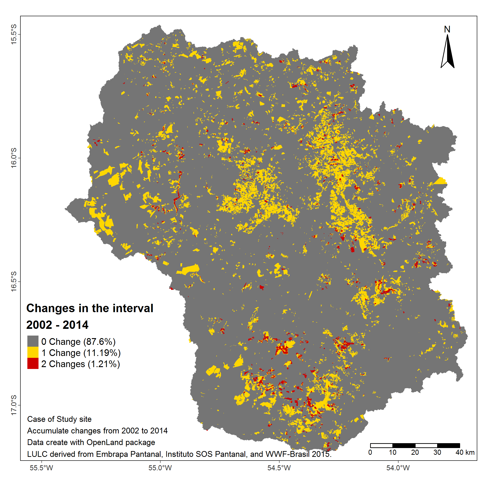

<style>
body {
text-align: justify}
</style>

```{r setup, include = FALSE}
knitr::opts_chunk$set(
  collapse = TRUE,
  comment = "#>"
)
```


----
**This is a Vignette on how to use the OpenLand package for exploratory analysis of Land Use and Cover (LUC) time series.**

## Description of the tool

OpenLand is an open-source R package for the analysis of land use and cover (LUC) time series. It includes support for consistency check and loading spatiotemporal raster data and synthesized spatial plotting. Several LUC change (LUCC) metrics in regular or irregular time intervals can be extracted and visualized through one- and multistep sankey and chord diagrams. A complete intensity analysis according to [@Aldwaik2012] is implemented, including tools for the generation of standardized multilevel output graphics.

## São Lourenço river Basin example dataset

The OpenLand functionality is illustrated for a LUC dataset of São Lourenço river basin, a major Pantanal wetland contribution area as provided by the 4^th^ edition of the [Monitoring of Changes in Land cover and Land Use in the Upper Paraguay River Basin - Brazilian portion - Review Period: 2012 to 2014](https://www.embrapa.br/pantanal/bacia-do-alto-paraguai) [@Embrapapantanalsite2015]. The time series is composed by five LUC maps (2002, 2008, 2010, 2012 and 2014). The study area of approximately 22,400 km^2^ is located in the Cerrado Savannah biom in the southeast of the Brazilian state of Mato Grosso, which has experienced a LUCC of about 12% of its extension during the 12-years period, including deforestation and intensification of existing agricultural uses.
For processing in the OpenLand package, the original multi-year shape file was transformed into rasters and then saved as a 5-layer `RasterStack` (`SaoLourencoBasin`), available from a public repository [(10.5281/zenodo.3685229)](https://doi.org/10.5281/zenodo.3685230) as an `.RDA` file which can be loaded into `R`.

```{r include=FALSE}
dataset_available <- tryCatch({
  # downloading the SaoLourencoBasin multi-layer raster and make it available into R
  url <- "https://zenodo.org/record/3685230/files/SaoLourencoBasin.rda?download=1"
  temp <- tempfile()
  download.file(url, temp, mode = "wb") # downloading the SaoLourencoBasin dataset
  load(temp)
}, error = function(e) {
  return(FALSE)
})
```

```{r include=FALSE, eval=isFALSE(dataset_available)}
knitr::knit_exit("## The complete rendering of this document depends on the availability of the dataset in zenodo. Please try at another time.")
```


### Input data constraints
The function `contingencyTable()` for data extraction demands as input a list of raster layers (`RasterBrick`, `RasterStack` or a path to a folder containing the rasters). The name of the rasters must be in the format ("some_text" `+` "underscore" `+` "the_year") like "landscape_2020". In our example we included the `SaoLourencoBasin` RasterStack:

```{r}
# first we load the OpenLand package
library(OpenLand)

# The SaoLourencoBasin dataset
SaoLourencoBasin

```

```{r eval=FALSE, fig.height=5, fig.width=7, include=FALSE}
#sp::spplot(SaoLourencoBasin)
```


### Extracting the data from raster time series

After data extraction `contingencyTable()` saves multiple grid information in tables for the next processing steps. The function returns `r length(SL_2002_2014)` objects: `r names(SL_2002_2014)`.

The first two objects are contingency tables. The first one (**`r names(SL_2002_2014)[1]`**) takes into account grid cells of the entire time series, whereas the second (**`r names(SL_2002_2014)[2]`**) calculates LUC transitions only between the first and last year of the series. The third object (**`r names(SL_2002_2014)[3]`**) is a table containing the category name associated with a pixel value and a respective color used for plotting. Category values and colors are created randomly by `contingencyTable()`. Their values must be edited to produce meaningful plot legends and color schemes. The fourth object (**`r names(SL_2002_2014)[4]`**) is a table containing the extension of the study area in km^2^ and in pixel units. The fifth table (**`r names(SL_2002_2014)[5]`**) stores the range between the first (Y~t=1~) and the last year(Y~T~) of the series.


Fields, format, description and labeling of a **`r names(SL_2002_2014)[1]`** table created by the `contingencyTable` are given in the following:

|[Y~_t_~, Y~_t+1_~] | Category~_i_~ | Category~_j_~ |C~_tij_~(km^2^)|C~_tij_~(pixel)|Y~_t+1_~ - Y~_t_~|Y~_t_~|Y~_t+1_~|
|:------------:|:----------:|:----------:|:--------------:|:--------------:|:------------:|:----:|:----:|
|`chr`|`int`|`int`|`dbl`|`int`|`int`|`int`|`int`|
|Period of analysis from time point _t_ to time point _t+1_|A category at interval’s initial time point|A category at  interval’s final time point|Number of elements in km^2^ that transits from category _i_ to category _j_|Number of elements in pixel that transits from category _i_ to category _j_|Interval in years between time point _t_ and time point _t+1_|Initial Year of the interval| Final Year of the interval|
|**Period**|**From**|**To**|**km2**|**QtPixel**|**Interval**|**yearFrom**|**yearTo**|

In the **`r names(SL_2002_2014)[2]`** table,  the Y~_t+1_~ terms are replaced by Y~_T_~, where T is the number of time steps, i.e., Y~_T_~ is the last year of the series.

For our study area, `contingenceTable(input_raster = SaoLourencoBasin, pixelresolution = 30)` returns the following outputs:


```{r}

# SL_2002_2014 <- contingenceTable(input_raster = SaoLourencoBasin, pixelresolution = 30)

SL_2002_2014

```

### Editing the values in the ``r names(SL_2002_2014$tb_legend[2])`` and ``r names(SL_2002_2014$tb_legend[3])`` columns
As mentioned before, the **`r names(SL_2002_2014[3])`** object must be edited with the real category name and colors associated with the category values. In our case, the category names and colors follow the conventions given by  @sospantanal2015 [(access document here, page 17)](https://www.embrapa.br/documents/1354999/1529097/BAP+-+Mapeamento+da+Bacia+do+Alto+Paraguai+-+estudo+completo/e66e3afb-2334-4511-96a0-af5642a56283). The Portuguese legend acronyms were maintained as defined in the original dataset.

|Pixel Value|Legend|Class|Use|Category|color|
|:---|:-----:|:-----------------|:-------------------|:------------------------------|:------|
|2        | Ap     | Anthropic | Anthropic Use | Pasture                             |#FFE4B5|
|3        | FF     | Natural   | NA            | Forest                              |#228B22|
|4        | SA     | Natural   | NA            | Park Savannah                       |#00FF00|
|5        | SG     | Natural   | NA            | Gramineous Savannah                 |#CAFF70|
|7        | aa     | Anthropic | NA            | Anthropized Vegetation              |#EE6363|
|8        | SF     | Natural   | NA            | Wooded Savannah                     |#00CD00|
|9        | Agua   | Natural   | NA            | Water body                          |#436EEE|
|10       | Iu     | Anthropic | Anthropic Use | Urban                               |#FFAEB9|
|11       | Ac     | Anthropic | Anthropic Use | Crop farming                        |#FFA54F|
|12       | R      | Anthropic | Anthropic Use | Reforestation                       |#68228B|
|13       | Im     | Anthropic | Anthropic Use | Mining                              |#636363|


```{r echo=TRUE}
## editing the category name
SL_2002_2014$tb_legend$categoryName <- factor(c("Ap", "FF", "SA", "SG", "aa", "SF", 
                                          "Agua", "Iu", "Ac", "R", "Im"),
                                  levels = c("FF", "SF", "SA", "SG", "aa", "Ap", 
                                         "Ac", "Im", "Iu", "Agua", "R"))

## add the color by the same order of the legend,
## it can be the color name (eg. "black") or the HEX value (eg. #000000)
SL_2002_2014$tb_legend$color <- c("#FFE4B5", "#228B22", "#00FF00", "#CAFF70", 
                                  "#EE6363", "#00CD00", "#436EEE", "#FFAEB9", 
                                  "#FFA54F", "#68228B", "#636363")

## now we have
SL_2002_2014$tb_legend

```


```{r eval=FALSE, include=FALSE}
knitr::kable(
caseStudy$lulc_Mulstistep[1:10, ]
)
```


At this point, one can choose to run the Intensity Analysis or create a series of non-spatial representations of LUCC, such like sankey diagrams with the `sankeyLand()` function, chord diagrams using the `chordDiagramLand()` function or bar plots showing LUC evolution trough the years using the `barplotLand()` function, since they do not depend on the output of Intensity Analysis.


## Intensity Analysis
Intensity Analysis (IA) is a quantitative method to analyze LUC maps at several time steps, using cross-tabulation matrices, where each matrix summarizes the LUC change at each time interval. IA evaluates in three levels the deviation between observed change intensity and hypothesized uniform change intensity. Hereby, each level details information given by the previous analysis level. First, the **interval level** indicates how size and rate of change varies across time intervals. Second, the **category level** examines for each time interval how the size and intensity of gross losses and gross gains in each category vary across categories for each time interval. Third, the **transition level** determines for each category how the size and intensity of a category’s transitions vary across the other categories that are available for that transition. At each level, the method tests for stationarity of patterns across time intervals [@Aldwaik2012].

Within the OpenLand package, the `intensityAnalysis()` function computes the three levels of analysis. It requires the object returned by the `contingenceTable()` function and that the user predefines two LUC categories `n` and `m`. Generally, `n` is a target category which experienced relevant gains and `m` a category with important losses.

```{r}
testSL <- intensityAnalysis(dataset = SL_2002_2014,
                            category_n = "Ap", category_m = "SG")

# it returns a list with 6 objects
names(testSL)

```

The `intensityAnalysis()` function returns `r length(testSL)` objects: `r names(testSL)`.
Here, we adopted an object-oriented approach that allows to set specific methods for plotting the intensity objects. Specifically, we used the S4 class, which requires the formal definition of classes and methods [@Chambers2008]. The first object is a contingency table similar to the `r names(SL_2002_2014)[1]` object with the unique difference that the columns `From` and `To` are replaced by their appropriate denominations according to the LUC legend.

The second object _**`r names(testSL[2])`**_ is an ``r class(testSL[[2]])`` object, the third _**`r names(testSL[3])`**_ and the fourth _**`r names(testSL[4])`**_ are ``r class(testSL[[4]])`` objects,  whereas the fifth _**`r names(testSL[5])`**_ and the sixth _**`r names(testSL[6])`**_ are ``r class(testSL[[6]])`` objects.

An ``r class(testSL[[2]])`` object contains one slot containing a table of  **interval level** result _(S~t~ and U values)_. A ``r class(testSL[[4]])`` object contains three slots: the first contains the colors associated with the legend items as name attributes, the second slot contains a table of the **category level** result _(gain (G~tj~) or loss (L~ti~) values)_  and the third slot contains a table storing the results of a stationarity test. A ``r class(testSL[[6]])`` object contains three slots: the first contains the color associated with the respective legend item defined as name attribute, the second slot contains a table of the **transition level** result _(gain n (R~tin~ and W~tn~) or loss m (Q~tmj~ and V~tm~) values)_. The third slot contains a table storing the results of a stationarity test. Hereby, @Aldwaik2012 consider a stationary case only when the intensities for all time intervals reside on one side of the uniform intensity, i.e. that they are always smaller or larger than the uniform rate over the whole period.


```{r }
# showing the objects from the intensity analysis for our illustrative case
testSL

```


## The Graphs 
### Outcomes of intensity analysis
Visualizations of the IA results are obtained from the `plot(intensity-object)` function. For more details on the function arguments, please see the documentation of the `plot()` method.

#### Interval Level

```{r fig.width=7, fig.height=4}

plot(testSL$interval_lvl,
     labels = c(leftlabel = "Interval Change Area (%)",
                rightlabel = "Annual Change Area (%)"),
     marginplot = c(-8, 0), labs = c("Changes", "Uniform Rate"), 
     leg_curv = c(x = 2/10, y = 3/10))

```

#### Category Level

* Gain Area

```{r fig.width=7, fig.height=4}

plot(testSL$category_lvlGain,
     labels = c(leftlabel = bquote("Gain Area (" ~ km^2 ~ ")"),
                rightlabel = "Intensity Gain (%)"),
     marginplot = c(.3, .3), labs = c("Categories", "Uniform Rate"), 
     leg_curv = c(x = 5/10, y = 5/10))


```

* Loss Area
```{r fig.width=7, fig.height=4}

plot(testSL$category_lvlLoss,
     labels = c(leftlabel = bquote("Loss Area (" ~ km^2 ~ ")"),
                rightlabel = "Loss Intensity (%)"),
     marginplot = c(.3, .3), labs = c("Categories", "Uniform Rate"), 
     leg_curv = c(x = 5/10, y = 5/10))

```

#### Transition Level

* Gain of the `n` category ("Ap")
```{r fig.width=7, fig.height=4}

plot(testSL$transition_lvlGain_n,
     labels = c(leftlabel = bquote("Gain of Ap (" ~ km^2 ~ ")"),
                rightlabel = "Intensity Gain of Ap (%)"),
     marginplot = c(.3, .3), labs = c("Categories", "Uniform Rate"), 
     leg_curv = c(x = 5/10, y = 5/10))

```

* Loss of the `m` category ("SG")
```{r fig.width=7, fig.height=4}

plot(testSL$transition_lvlLoss_m,
     labels = c(leftlabel = bquote("Loss of SG (" ~ km^2 ~ ")"),
                rightlabel = "Intensity Loss of SG (%)"),
     marginplot = c(.3, .3), labs = c("Categories", "Uniform Rate"), 
     leg_curv = c(x = 1/10, y = 5/10))
  

```

### Miscellaneous visualization tools

OpenLand provides a bench of visualization tools of LUCC metrics. One-step transitions can be balanced by net and gross changes of all categories through a combined bar chart.  Transitions between LUC categories can be detailed by a circular chord chart, based on the Circlize package [@Gu2014]. An implementation of  Sankey diagram based on the networkD3 package [@Allaire2017] allow the representation of one- and multistep LUCC between categories. Areal development of all LUC categories throughout the observation period can be visualized by a grouped bar chart. 

#### Net and Gross gain and loss

```{r fig.width=7, fig.height=4}

netgrossplot(dataset = SL_2002_2014$lulc_Multistep,
             legendtable = SL_2002_2014$tb_legend,
             xlab = "LUC Category",
             ylab = bquote("Area (" ~ km^2 ~ ")"),
             changesLabel = c(GC = "Gross changes", NG = "Net Gain", NL = "Net Loss"),
             color = c(GC = "gray70", NG = "#006400", NL = "#EE2C2C")
             )

```


#### Chord Diagram (2002 - 2014)

```{r fig.width=7, fig.height=6}

chordDiagramLand(dataset = SL_2002_2014$lulc_Onestep,
                 legendtable = SL_2002_2014$tb_legend)

```

#### Sankey Multi Step

```{r fig.width=8, fig.height=4}

sankeyLand(dataset = SL_2002_2014$lulc_Multistep,
           legendtable = SL_2002_2014$tb_legend)


```


```
         2002               2008               2010                2012                2014
```

#### Sankey One Step

```{r fig.width=8, fig.height=4}

sankeyLand(dataset = SL_2002_2014$lulc_Onestep,
           legendtable = SL_2002_2014$tb_legend)

```
```
                        2002                                              2014
```

#### An Evolution Bar Plot

```{r fig.width=7, fig.height=4}

barplotLand(dataset = SL_2002_2014$lulc_Multistep, 
          legendtable = SL_2002_2014$tb_legend,
          xlab = "Year",
          ylab = bquote("Area (" ~ km^2~ ")"),
          area_km2 = TRUE)

```

## Other functions
Two auxiliary functions allow users to check for consistency in the input gridded LUC time series, including extent, projection, cell resolution and categories. The `summary_map()` function returns the number of pixel by category of a single raster layer, whereas `summary_dir()` lists the spatial extension, spatial resolution, cartographic projection and the category range for the LUC maps. 
OpenLand enables furthermore the spatial screening of LUCC frequencies for one or a series of raster layers. The `acc_changes()` returns for LUC time series the number of times a pixel has changed during the analysed period, returning a grid layer and a table with the percentages of transition numbers in the study area.


```{r}

# testacc <- acc_changes(SaoLourencoBasin)
# 
# testacc

```

Plotting the map with the `tmap` function:

```{r fig.height=7, fig.width=7}

# tmap_options(max.raster = c(plot = 41711112, view = 41711112))

# acc_map <- tmap::tm_shape(testacc[[1]]) +
#   tmap::tm_raster(
#     style = "cat",
#     labels = c(
#       paste0(testacc[[2]]$PxValue[1], " Change", " (", round(testacc[[2]]$Percent[1], 2), "%", ")"),
#       paste0(testacc[[2]]$PxValue[2], " Change", " (", round(testacc[[2]]$Percent[2], 2), "%", ")"),
#       paste0(testacc[[2]]$PxValue[3], " Changes", " (", round(testacc[[2]]$Percent[3], 2), "%", ")")
#     ),
#     palette = c("#757575", "#FFD700", "#CD0000"),
#     title = "Changes in the interval \n2002 - 2014"
#   ) +
#   tmap::tm_legend(
#     position = c(0.01, 0.2),
#     legend.title.size = 1.2,
#     legend.title.fontface = "bold",
#     legend.text.size = 0.8
#   ) +
#   tmap::tm_compass(type = "arrow",
#                    position = c("right", "top"),
#                    size = 3) +
#   tmap::tm_scale_bar(
#     breaks = c(seq(0, 40, 10)),
#     position = c(0.76, 0.001),
#     text.size = 0.6
#   ) +
#   tmap::tm_credits(
#     paste0(
#       "Case of Study site",
#       "\nAccumulate changes from 2002 to 2014",
#       "\nData create with OpenLand package",
#       "\nLULC derived from Embrapa Pantanal, Instituto SOS Pantanal, and WWF-Brasil 2015."
#     ),
#     size = 0.7,
#     position = c(0.01, -0, 01)
#   ) +
#   tmap::tm_graticules(
#     n.x = 6,
#     n.y = 6,
#     lines = FALSE,
#     #alpha = 0.1
#     labels.rot = c(0, 90)
#   ) +
#   tmap::tm_layout(inner.margins = c(0.02, 0.02, 0.02, 0.02))
#
#
#
#
# tmap::tmap_save(acc_map,
#                 filename = "vignettes/acc_mymap.png",
#                 width = 7,
#                 height = 7)


```

```{r mymap, echo=FALSE, fig.cap='Accumulated changes in pixels in the interval 2002 - 2014 at four time points (2002, 2008, 2010, 2012, 2014)', out.width='100%'}



```


# References
